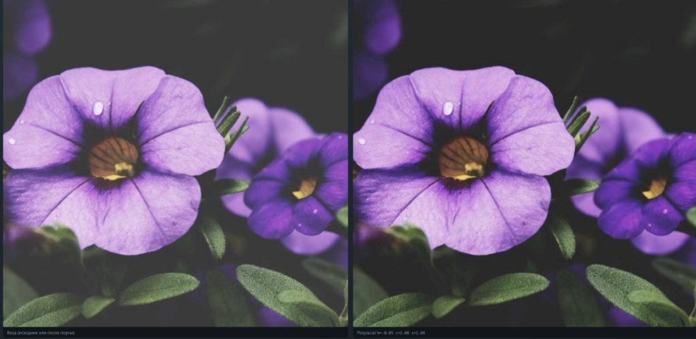
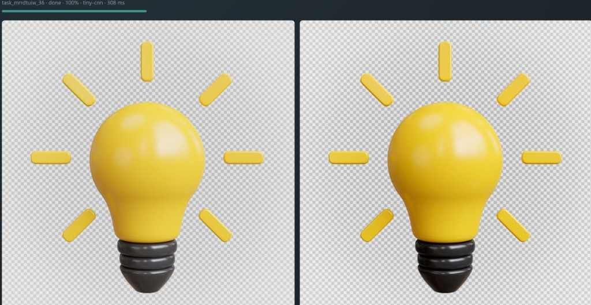

# VK Image Enhancer

Клиентский модуль улучшения изображений **в браузере**: нейросеть (или эвристика) подбирает параметры яркости / контраста / цветности, затем `apply` применяет их к полному кадру.

**Продукт — JS-библиотека** (`ImageEnhancer` в `dist/`), не сайт. `demo/` — витрина API.

Обработка идёт **асинхронно в Web Worker**: главный поток UI не блокируется (можно двигать страницу, жать «Отмена», следить за progress).

| Требование | Статус |
|------------|--------|
| Современные браузеры | Chrome / Firefox / Edge / Яндекс / Opera |
| Форматы | JPG, PNG, BMP, HEIC |
| Асинхронность (без блокировки UI) | да — Dedicated Web Worker |
| До 15 Мпк, ≤30 с | да; типично **~70 мс – 2 с** |
| Бандл ≤10 МБ | да (~1.4 МБ dist + ~0.2 МБ веса) |

## Быстрый старт (demo)

```bash
npm install
npm test
npm run demo
```

Откроется **http://127.0.0.1:5173/**. По умолчанию — **ML-модель** (`enhance_params.bin`). Остановка: `Ctrl+C`.

## Качество

Модель обучена на **17 000** случайно испорченных фотографиях (синтетическая порча в пространстве `apply`), собранных из трёх датасетов:

- [DIV2K High Resolution Images](https://www.kaggle.com/datasets/soumikrakshit/div2k-high-resolution-images)
- [Human Faces Dataset](https://www.kaggle.com/datasets/kaustubhdhote/human-faces-dataset?resource=download)
- [Reddit Memes Dataset](https://www.kaggle.com/datasets/sayangoswami/reddit-memes-dataset/data)

Пример (вход после порчи → результат TinyCNN):



## Скорость

Время end-to-end обычно **от ~70 мс до ~2 с** в зависимости от разрешения и формата. **HEIC** декодируется дольше (конвертация на main thread), затем тот же пайплайн в Worker.



## Форматы

Поддерживаются **JPG, PNG, HEIC, BMP** (HEIC → PNG через bundled-декодер, превью в demo тоже декодируется).

## Размер решения

| Что | Объём (ориентир) |
|-----|------------------|
| Исходный код проекта (src, scripts, tools/train, demo HTML, конфиги) | ~0.11 МБ |
| Собранный `dist/` (модуль + HEIC vendor) | ~1.4 МБ |
| Веса `enhance_params.bin` (float16) | ~0.2 МБ |
| **Суммарно для встраивания** | **≲ 1.6 МБ** (лимит 10 МБ) |

**Оптимизация размера:** веса модели экспортируются в **бинарный** файл `enhance_params.bin` и хранятся в **float16** (при инференсе в браузере поднимаются в float32). Так файл весов примерно вдвое меньше, чем float32, и заметно компактнее JSON.

Проверка: `npm run check:size`.

## Встраивание как библиотека

1. `npm run build` — артефакты в `dist/` (и `models/` → `demo/models/`).
2. Отдайте со своего хоста **весь** `dist/` и при необходимости `enhance_params.bin`.
3. Пример:

```ts
import { ImageEnhancer } from './dist/index.js';

const enhancer = new ImageEnhancer({
  workerUrl: new URL('./dist/worker.js', import.meta.url),
  heicDecoderUrl: new URL('./dist/vendor/heic2any.js', import.meta.url),
});

enhancer.on('status', (info) => {
  console.log(info.status, info.progress, info.metrics?.params);
});

const id = await enhancer.submit(file, {
  // omit outputType → PNG if input has alpha, else JPEG
  predictorMode: 'model', // по умолчанию в demo — модель
  modelUrl: './models/enhance_params.bin',
});

const blob = await enhancer.getResult(id);
enhancer.cancel(id);
enhancer.dispose();
```

### API модуля

| Метод / событие | Назначение |
|-----------------|------------|
| `submit` | поставить задачу, вернуть `taskId` |
| `getStatus` | статус и progress |
| `cancel` | прервать задачу |
| `getResult` | готовый `Blob` |
| `on('status')` | события смены статуса / прогресса |

`b` / `c` / `s` — предсказанные **brightness**, **contrast**, **saturation**.

## Структура

```
src/            исходники библиотеки (API, Worker, decode/apply, ML)
demo/           витрина API
models/         enhance_params.bin (веса для браузера)
assets/         картинки для README
tools/train/    датасеты, augment, PyTorch train/export
scripts/        build helpers
```

Если в клоне есть `models/enhance_params.bin`, после `npm run build` demo использует **эти веса**. Без файла — только эвристика.

## Обучение модели

1. Исходники в `tools/train/raw/` → 2. `augment.py` → 3. `train.py` → 4. `export_web_weights.py` → `.bin` → 5. `npm run build`

### Несколько источников и сила порчи

Формат `--source`: `путь:число` или `путь:число:сила` (`1.0` обычная, `0.25` в 4 раза слабее).  
`--seed 42` — воспроизводимый рандом.

```powershell
python clean_dataset.py -y
python augment.py --output ./dataset --seed 42 --source "./raw/div2k/DIV2K_valid_HR:5000" --source "./raw/HumanFacesDataset/RealImages:7000" --source "./raw/memes/memes:5000:0.25"
python shuffle_dataset.py --data ./dataset --seed 42
python train.py --data ./dataset --epochs 20 --out ./checkpoints/model.pt --save-every 5
python export_web_weights.py --checkpoint ./checkpoints/model.pt --out ../../models/enhance_params.bin
```

Дообучение: `--resume ./checkpoints/model.pt` (лучше меньший `--lr`).  
Подробнее: `tools/train/DATASETS.md`.
